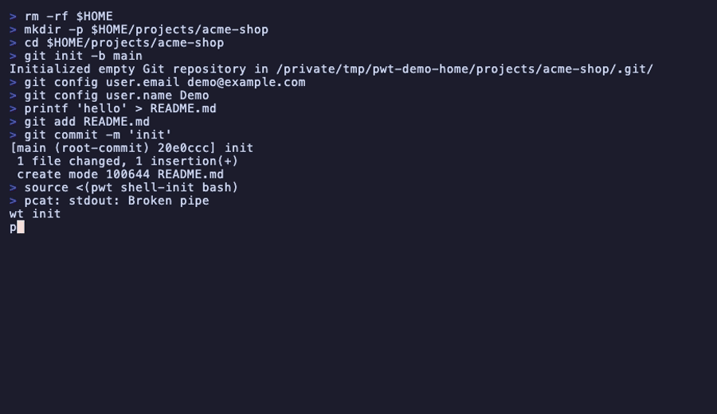

# pwt - Power Worktrees

**A powerful Git worktree workflow.**

[](https://github.com/jonasporto/pwt/actions/workflows/test.yml)
[](LICENSE)
[](CHANGELOG.md)



---

## The idea in one sentence

> Keep one editor open. Swap code underneath it.

```bash
# Open editor once
subl "$(pwt current)"

# Switch context instantly
pwt use TICKET-456    # symlink swaps, editor sees new code
pwt use TICKET-789    # switch again, no new windows
```

```
editor ──> current ──> TICKET-123
                  └──> TICKET-456
                  └──> TICKET-789
```

**The core insight:** You don't need 6 editor windows. You need one editor pointing to a stable path, and the ability to swap what's behind that path.

---

## TL;DR

- One editor, one stable path, infinite worktrees
- `pwt use` swaps code instantly via symlink
- Worktrees by default, clones when needed (`--clone`)
- Project logic lives in `Pwtfile` (setup/server/teardown)

pwt manages git worktrees with port allocation and project isolation. It's framework-agnostic: Rails, Node, Go, Python — pwt doesn't care. Your project-specific setup lives in `Pwtfile`, not in pwt's core.

---

## The pain it removes

When you have multiple projects in flight, the mental model collapses. pwt brings back one-project-at-a-time clarity without shutting anything down.
It does not fix every app or tab, but it makes the local project story boring again: one current path, explicit worktree state, predictable ports.

- **"Which terminal tab am I in?"** → `pwt ps1`, `pwt current`, and `pwt status` make the active worktree explicit.
- **"What is using :3000?"** → per-worktree ports + `pwt tree --ports` and `pwt fix-port` to resolve conflicts.
- **"Where is the dev server for this branch?"** → `pwt server` runs the right command from your `Pwtfile`.
- **"Too many editor windows"** → `pwt use` swaps a stable `current` symlink; keep one editor open.
- **"Setup is tribal knowledge"** → `Pwtfile` codifies setup/teardown in the repo.
- **"Old branches everywhere"** → `pwt auto-remove` cleans merged worktrees safely.

## LLM-friendly by default

pwt is designed to be easy for humans *and* agents:

- **Scriptable output:** `pwt list --porcelain` and `pwt current --json`
- **One-shot docs:** `pwt help all` (full concepts + commands)
- **Scoped execution:** `pwt run` / `pwt ai` run tools in the correct worktree

---

## Why not just clones?

Cloning the same repository multiple times is a valid workflow. So why worktrees?

**Short answer:** Git worktrees share Git objects, clones duplicate them. For large repos, this saves **hundreds of MB or GB** per workspace.

| Mode | Flag | Pros |
|------|------|------|
| **Worktree (default)** | - | Faster, lower disk usage, shared Git objects |
| **Clone** | `--clone` | Full isolation, no branch locks, safer with submodules |

```bash
pwt create feature master              # Creates worktree (default)
pwt create feature master --clone      # Creates clone instead
```

> Use worktrees when you can. Use clones when you need to.

**Why people still prefer clones:** Branch locking (same branch can't be checked out twice) and submodules work more predictably with clones. Both modes use the same pwt commands and Pwtfile.

---

## Install

### macOS (Homebrew) - recommended

```bash
brew tap jonasporto/pwt
brew install pwt
```

### JavaScript (npm/bun)

```bash
npm i -g @jonasporto/pwt
npx @jonasporto/pwt --help
bunx @jonasporto/pwt --help
```

### No repo (curl, macOS/Linux/WSL)

```bash
curl -fsSL https://raw.githubusercontent.com/jonasporto/pwt/main/install.sh -o /tmp/pwt-install.sh
less /tmp/pwt-install.sh
bash /tmp/pwt-install.sh --ref vX.Y.Z --tag --sha256 <sha256>
# or latest from main (no checksum)
bash /tmp/pwt-install.sh --ref main --branch
```

### From source

```bash
git clone https://github.com/jonasporto/pwt.git ~/.pwt-src
cd ~/.pwt-src
make install PREFIX=~/.local
```

**Dependencies:** `git`, `jq` (required). `make` (required for source install). `fzf`, `lsof` (optional).
```bash
brew install git jq make fzf  # macOS
```

Windows users: use WSL (native Windows shell is not supported).

See [INSTALL.md](INSTALL.md) for setup details and troubleshooting.

---

## Quick Start

```bash
# Initialize your project
cd ~/Projects/myapp
pwt init

# Create a worktree
pwt create TICKET-123 main "fix login bug"

# Switch context instantly
pwt use TICKET-123

# Always know where you are
pwt ps1   # pwt@TICKET-123
```

**The key insight:** `pwt use` swaps a symlink. Your editor stays open, pointing to `$(pwt current)`. When you switch, the editor sees different code — no new windows.

---

## Capistrano-style Symlink

**Think Capistrano's `current`, but for local worktrees.**

pwt maintains a symlink pointing to your active worktree:
```
~/.pwt/projects/myapp/current -> /path/to/worktrees/TICKET-123
```

```bash
pwt use TICKET-456
# current → TICKET-456 (branch jp/TICKET-456)
#          port :5009
```

This atomically swaps the symlink. It does **NOT** open new editor windows, kill processes, or change your shell directory.

**Single Editor Workflow:**
```bash
subl "$(pwt current)"   # open once

pwt use TICKET-789      # switch context
# Editor now sees different code
```

Works with: Sublime, VS Code, Cursor, Neovim, JetBrains (may need "Reload Project").

---

## Pwtfile

**Pwtfile is your project-local workflow file. Like a Makefile, but for worktree lifecycle.**

pwt handles worktree management and port allocation. Everything else — dependencies, database setup, server config — lives in your Pwtfile:

```bash
# Pwtfile
PORT_BASE=5001

setup() {
    pwtfile_copy ".env"
    pwtfile_symlink "node_modules"
    bundle install
}

server() {
    PORT="$PWT_PORT" npm start
}

teardown() {
    # Drop test databases, cleanup...
}
```

**Available variables:** `$PWT_PORT`, `$PWT_WORKTREE`, `$PWT_WORKTREE_PATH`, `$PWT_BRANCH`, `$PWT_PROJECT`

**Helpers:** `pwtfile_copy`, `pwtfile_symlink`, `pwtfile_env`, `replace_literal`, `replace_re`

---

## Navigation

**Start here:** [Install](#install) · [Quick Start](#quick-start)

**Deep dive:** [Commands](#commands) · [Pwtfile Details](#pwtfile-details) · [Shell Integration](#shell-integration) · [Plugins](#plugins)

---

## Commands

| Command | Description |
|---------|-------------|
| `init [url]` | Initialize project (clone from URL or configure current repo) |
| `create <branch> [base] [desc]` | Create new worktree |
| `list [flags]` | List worktrees and status |
| `tree [flags]` | Visual tree view |
| `status [flags]` | Interactive TUI dashboard (like htop) |
| `info [worktree]` | Show worktree details |
| `cd [worktree\|@\|-] [--select]` | Navigate to worktree (--select for fzf picker) |
| `use <worktree> [--select]` | Switch current symlink (--select for fzf picker) |
| `current [flags]` | Show current worktree |
| `ps1` | Fast prompt helper (for shell prompts) |
| `remove [worktree] [flags]` | Remove worktree |
| `run [worktree] <cmd>` | Run command in worktree |
| `for-each <cmd>` | Run command in all worktrees |
| `server [worktree]` | Start development server |
| `editor [worktree]` | Open worktree in editor |
| `ai [worktree] [-- args]` | Start AI tool in worktree |
| `open [worktree]` | Open worktree in Finder |
| `diff <wt1> [wt2]` | Show diff between worktrees |
| `copy <src> <dest> <patterns...>` | Copy files between worktrees |
| `fix-port [worktree]` | Resolve port conflict |
| `auto-remove [target] [flags]` | Remove merged worktrees |
| `restore [backup] [worktree]` | Recover backed up changes from trash |
| `doctor` | Check system health |
| `meta [action] [args]` | Manage worktree metadata |
| `project [action] [args]` | Manage project configs |
| `config <key> [value]` | Configure current project |
| `plugin [action]` | Manage plugins |
| `shell-init [shell]` | Output shell integration code |
| `setup-shell` | Install shell integration automatically |
| `help [topic]` | Show help (topics: concepts, commands, navigation, pwtfile, all) |

### Help Topics

```bash
pwt help              # Brief help with command list
pwt help concepts     # What is pwt, worktree vs clone
pwt help commands     # Full command reference
pwt help navigation   # cd, use, multi-project
pwt help pwtfile      # Syntax, hooks, helpers, examples
pwt help all          # Everything (good for LLMs)
```

### Create Flags

| Flag | Description |
|------|-------------|
| `-e, --editor` | Open editor after creating |
| `-a, --ai` | Start AI tool after creating |
| `--from <ref>` | Create from specific ref (tag, commit, branch) |
| `--from-current` | Create from current branch |
| `--clone` | Use git clone instead of worktree |
| `--dry-run, -n` | Preview without creating |

### List Flags

| Flag | Description |
|------|-------------|
| `-v, --verbose` | Detailed output |
| `--dirty` | Only worktrees with uncommitted changes |
| `--porcelain` | Machine-readable JSON |

### Remove Flags

| Flag | Description |
|------|-------------|
| `--with-branch` | Also delete the branch (if merged) |
| `--force-branch` | Force delete the branch |
| `--kill-port` | Kill processes using the port |
| `-y, --yes` | Skip confirmation |

### Current Flags

| Flag | Description |
|------|-------------|
| `--name` | Output only worktree name |
| `--port` | Output only port number |
| `--branch` | Output only branch name |
| `--json` | Output full info as JSON |

---

## Visual Commands

### `pwt status` — Interactive Dashboard

Full-screen TUI (like htop) for monitoring worktrees:

```bash
pwt status         # Current project
pwt status --all   # All projects
```

**Keyboard:** `↑↓`/`jk` navigate, `Tab` switch pane, `Enter` select, `s` toggle server, `q` quit

### `pwt tree` — Quick Overview

```
myapp
├─ @ (main)                    master
├─ TICKET-123        :5001     feature/login    *
├─ TICKET-456        :5002     fix/api-error
└─ TICKET-789        :5003     refactor/auth    +
```

Flags: `--all`, `--dirty`, `--ports`

---

## Shell Integration

Enable `pwt cd` navigation and tab completion:

**Zsh (~/.zshrc):**
```bash
eval "$(pwt shell-init zsh)"
```

**Bash (~/.bashrc):**
```bash
eval "$(pwt shell-init bash)"
```

**Fish (~/.config/fish/config.fish):**
```fish
pwt shell-init fish | source
```

### Navigation

```bash
pwt cd TICKET-123   # Go to worktree
pwt cd              # Go to last-used worktree
pwt cd @            # Go to main worktree
pwt cd -            # Go to previous worktree
```

### Prompt Integration

```bash
# Add to ~/.zshrc
pwt_prompt_info() {
  [[ -n "$PWT_WORKTREE" ]] && echo "[wt:$PWT_WORKTREE] "
}
PROMPT='$(pwt_prompt_info)'$PROMPT
```

### `pwt ps1` — Fast Prompt Helper

```bash
$ pwt ps1
pwt@TICKET-123

# If pwd differs from current symlink:
pwt@TICKET-123!    # The ! warns of mismatch
```

**tmux:** `set -g status-right '#(pwt ps1)'`

---

## Pwtfile Details

### Full Example

```bash
# Pwtfile
PORT_BASE=5001

setup() {
    pwtfile_copy ".env"              # Copy .env from main
    pwtfile_symlink "node_modules"   # Share node_modules
    pwtfile_symlink ".cache"         # Share cache

    bundle install
    yarn install

    # Safe replacements
    replace_literal "config/database.yml" "db_test" "db_test_wt${PWT_PORT}"
    replace_re ".env" "PORT=\d+" "PORT=$PWT_PORT"
}

server() {
    foreman start -p "$PWT_PORT"
}

teardown() {
    # Drop test databases, remove temp files
}
```

### Available Variables

| Variable | Description |
|----------|-------------|
| `$PWT_PORT` | Allocated port for this worktree |
| `$PWT_WORKTREE` | Worktree name |
| `$PWT_WORKTREE_PATH` | Full path to worktree |
| `$PWT_BRANCH` | Git branch name |
| `$PWT_TICKET` | Same as worktree name |
| `$PWT_PROJECT` | Project name |
| `$MAIN_APP` | Path to main app |

### Helpers

| Helper | Description |
|--------|-------------|
| `pwtfile_symlink <path>` | Symlink from main app |
| `pwtfile_copy <path>` | Copy from main app |
| `pwtfile_env <var> <value>` | Set environment variable |
| `pwtfile_run <cmd>` | Run command (silent on error) |
| `pwtfile_replace_literal <file> <from> <to>` | Literal string replacement |
| `pwtfile_replace_re <file> <pattern> <replacement>` | Regex replacement |
| `pwtfile_hash_port [name] [base]` | Deterministic port from name |

### Global Pwtfile

Create `~/.pwt/Pwtfile` for hooks that run on all projects:

```bash
# ~/.pwt/Pwtfile
setup() {
    zoxide add "$PWT_WORKTREE_PATH"
}
```

---

## Plugins

Plugins extend pwt with reusable commands across all projects.

```bash
pwt plugin list              # List installed
pwt plugin create my-feature # Create new plugin
pwt plugin install /path/to  # Install from file
pwt plugin remove my-feature # Remove plugin
```

### Official Plugins

**pwt-aitools** — AI integration:
```bash
cp plugins/pwt-aitools ~/.pwt/plugins/
pwt aitools topology    # LLM-powered Pwtfile analysis
pwt aitools context     # Generate AI context
```

**pwt-extras** — Extra utilities:
```bash
cp plugins/pwt-extras ~/.pwt/plugins/
pwt extras benchmark    # Compare disk usage
pwt extras marker       # Set worktree markers
pwt extras conflicts    # Show file overlap
```

### Creating Plugins

```bash
#!/bin/bash
# ~/.pwt/plugins/pwt-deploy

case "${1:-}" in
    staging)
        echo "Deploying $PWT_WORKTREE to staging..."
        ;;
    *)
        echo "Usage: pwt deploy [staging|production]"
        ;;
esac
```

**Plugin vs Pwtfile:** Plugins are global (reusable), Pwtfile is per-project (specific setup).

---

## Configuration

### Project Config

```bash
pwt init git@github.com:user/myapp.git   # Clone + configure
pwt init                                  # Configure existing repo

pwt config branch_prefix "user/"
pwt config worktrees_dir ~/Projects/myapp-worktrees
```

### Directory Structure

```
~/.pwt/
├── meta.json           # Worktree metadata
├── Pwtfile             # Global hooks
├── plugins/            # Custom plugins
└── projects/
    └── myproject/
        ├── config.json
        └── current -> /path/to/worktree
```

### Project Selection

```bash
pwt myproject create ...       # Project as first arg
pwt --project myproject ...    # Explicit flag
```

---

## Dependencies

| Dependency | Required | Purpose |
|------------|----------|---------|
| git | ✅ | Core worktree management |
| jq | ✅ | JSON metadata storage |
| lsof | Recommended | Port conflict detection |
| fzf | Recommended | Interactive selection |

---

## Philosophy: rvm-like Context Switching

pwt gives you the rvm experience without the dangerous hacks.

**What rvm does (risky):** Modifies `$PATH` dynamically, magic directory detection.

**What pwt does instead:**
- **Real directories** — each worktree is a full working copy
- **Smart switcher** — `pwt cd --select` with fzf, preview, keybindings
- **Hidden paths** — worktrees live in `project-worktrees/`, out of your way
- **Visible context** — `$PWT_WORKTREE`, statusline, prompt integration
- **Session-aware** — `pwt server`, `pwt editor` know where you are

```bash
pwt cd --select         # Pick interactively
pwt cd                  # Return to last-used
pwt current --name      # Which worktree am I in?
```

---

## Examples

```bash
# Create worktree for a ticket
pwt create TICKET-123 master "implement feature"

# Create and open in editor + AI
pwt create TICKET-123 master "feature" -e -a

# Create from a tag (hotfix)
pwt create hotfix --from v1.2.3

# Create clone (for submodules)
pwt create TICKET-123 master --clone

# Navigate
pwt cd TICKET-123
pwt cd -              # Go back

# Switch symlink (no new windows)
pwt use TICKET-456
pwt use --select      # Interactive picker

# Run commands
pwt run TICKET-123 npm test
pwt for-each git status -s

# Query current
pwt current --name
pwt current --json
cd "$(pwt current)"

# Cleanup
pwt auto-remove master --dry-run
pwt remove TICKET-123 --with-branch
```

---

## Known Limitations

### Editor Git Status with `current` Symlink

Editors cache git info when opened. File contents update correctly after `pwt use`, but git status bar stays stale.

**Workaround:** Close and reopen folder, or use `subl "$(pwt current)"` after switching.

### Symlink Best Practices

| ✅ Do | ⚠️ Don't |
|-------|----------|
| Open editor via `$(pwt current)` | Run servers from `current` path |
| Use `pwt use` to switch context | Expect LSP to auto-reload |
| Run `pwt server` from worktree dir | Store state in `current` path |

The symlink is a convenience for editing, not a safety mechanism.

---

## Documentation

- **Man page:** `man pwt`
- **FAQ:** [FAQ.md](FAQ.md)
- **Changelog:** [CHANGELOG.md](CHANGELOG.md)
- **Install guide:** [INSTALL.md](INSTALL.md)

---

## Command Reference

### Project Commands

Commands that operate at project level (multi-project management).

| Command | Options | Description |
|---------|---------|-------------|
| `init [url]` | | Initialize project from current repo or clone from URL |
| `project list` | | List all configured projects |
| `project init <name>` | | Initialize new project config |
| `project show [name]` | | Show project configuration |
| `project set <key> <value>` | | Update project config |
| `project path [name]` | | Print project config directory |
| `project alias [alias]` | `--clear` | Set or show project alias |
| `config <key> [value]` | | Configure current project (main_app, worktrees_dir, branch_prefix, base_port) |
| `doctor` | | Check system health and configuration |
| `shell-init [shell]` | | Output shell integration code (zsh, bash, fish) |
| `setup-shell` | | Install shell integration automatically |
| `help [topic]` | | Show help (concepts, commands, navigation, pwtfile, all) |

### Worktree Commands

Commands that operate on worktrees within a project.

#### `create <name> [base] [desc]` — Create new worktree

| Option | Description |
|--------|-------------|
| `-e`, `--editor` | Open editor after creation |
| `-a`, `--ai` | Start AI tool after creation |
| `--from <ref>` | Create from specific ref (tag, commit, branch) |
| `--from-current` | Create from current branch |
| `--dry-run`, `-n` | Show what would be created without doing it |
| `--clone` | Use git clone instead of worktree (for submodules) |

#### `list` — List worktrees

| Option | Description |
|--------|-------------|
| `-v`, `--verbose` | Show detailed info (branch, port, status) |
| `--dirty` | Only show worktrees with uncommitted changes |
| `--porcelain` | Machine-readable output |
| `--names` | Output only worktree names (for scripts) |
| `statusline` | Compact output for shell prompts |

#### `tree` — Visual tree view

| Option | Description |
|--------|-------------|
| `--all` | Include all projects |
| `--dirty` | Highlight dirty worktrees |
| `--ports`, `-p` | Show allocated ports |

#### `status` — Interactive TUI dashboard

| Option | Description |
|--------|-------------|
| `--all` | Show all projects (global view) |

#### `cd [worktree|@|-]` — Navigate to worktree

| Option | Description |
|--------|-------------|
| `--select`, `-s` | Interactive fzf picker |
| `@` | Navigate to main app |
| `-` | Navigate to previous worktree (like `cd -`) |

#### `use <worktree>` — Set current symlink

| Option | Description |
|--------|-------------|
| `--select`, `-s` | Interactive fzf picker |

#### `current` — Show current worktree

| Option | Description |
|--------|-------------|
| `--name` | Output only the worktree name |
| `--resolved` | Show actual path (not symlink) |
| `--json` | JSON output with full metadata |

#### `remove [worktree]` — Remove worktree

| Option | Description |
|--------|-------------|
| `--with-branch` | Also delete the branch (if merged) |
| `--force-branch` | Force delete branch (even if not merged) |
| `--kill-port` | Kill processes using the allocated port |
| `--kill-sidekiq` | Kill Sidekiq processes |
| `--kill-all` | Kill both port and Sidekiq processes |
| `-y`, `--yes` | Skip confirmation prompts |

#### `auto-remove [target]` — Remove merged worktrees

| Option | Description |
|--------|-------------|
| `--execute` | Actually remove (default is dry-run) |
| `--dry-run` | Show what would be removed |

#### Other worktree commands

| Command | Description |
|---------|-------------|
| `info [worktree]` | Show worktree details |
| `ps1` | Fast prompt helper (no git ops, O(1)) |
| `run [worktree] <cmd>` | Run command in worktree context |
| `for-each <cmd>` | Run command in all worktrees |
| `server [worktree]` | Start dev server (from Pwtfile) |
| `editor [worktree]` | Open worktree in editor |
| `ai [worktree] [-- args]` | Start AI tool in worktree |
| `open [worktree]` | Open worktree in Finder |
| `diff <wt1> [wt2]` | Show diff between worktrees |
| `copy <src> <dest> <patterns...>` | Copy files between worktrees |
| `fix-port [worktree]` | Resolve port conflict |
| `restore [backup] [worktree]` | Recover backed up changes from trash |
| `port [worktree]` | Get allocated port |

#### `meta` — Manage worktree metadata

| Subcommand | Description |
|------------|-------------|
| `meta list` | List all metadata |
| `meta show <worktree>` | Show metadata for worktree |
| `meta set <worktree> <key> <value>` | Update metadata field |
| `meta import` | Import existing worktrees |

#### `ai` — AI coding tools

Start AI tools in worktree context. Supports multiple tools with custom configurations.

| Command | Description |
|---------|-------------|
| `ai [worktree]` | Run default AI tool in worktree |
| `ai:<tool> [worktree]` | Run specific tool (e.g., `ai:gemini`) |
| `ai add <name> "<cmd>"` | Add a tool with custom command |
| `ai remove <name>` | Remove a tool |
| `ai list` | List configured tools |
| `ai:<name> --default` | Set as default tool |
| `ai help` | Show AI command help |

**Examples:**
```bash
pwt ai                        # Run default tool in main
pwt ai TICKET-123             # Run default in worktree
pwt ai:gemini                 # Run gemini in main
pwt ai:gemini TICKET-123      # Run gemini in worktree
pwt ai:codex -- --full-auto   # Run with extra args
pwt ai add mcp "claude --mcp" # Add custom tool
```

**Resolution order:** config → PATH → error

#### `plugin` — Manage plugins

| Subcommand | Description |
|------------|-------------|
| `plugin list` | List installed plugins |
| `plugin install <name>` | Install a plugin |
| `plugin remove <name>` | Remove a plugin |
| `plugin create <name>` | Create new plugin from template |
| `plugin path` | Show plugins directory |

### Special Targets

| Target | Description |
|--------|-------------|
| `@` | Main app directory (e.g., `pwt cd @`) |
| `-` | Previous worktree (e.g., `pwt cd -`) |
| `current` | Stable symlink path (e.g., `pwt cd current`) |

### Environment Variables

| Variable | Description |
|----------|-------------|
| `PWT_WORKTREE` | Current worktree name |
| `PWT_WORKTREE_PATH` | Full path to worktree |
| `PWT_PORT` | Allocated port number |
| `PWT_BRANCH` | Git branch name |
| `PWT_PROJECT` | Project name |
| `PWT_TICKET` | Extracted ticket number |
| `PWT_ARGS` | Arguments passed to Pwtfile commands |

---

## Contributing

```bash
make test     # Run tests
make lint     # Check syntax
make install PREFIX=~/.local
```
