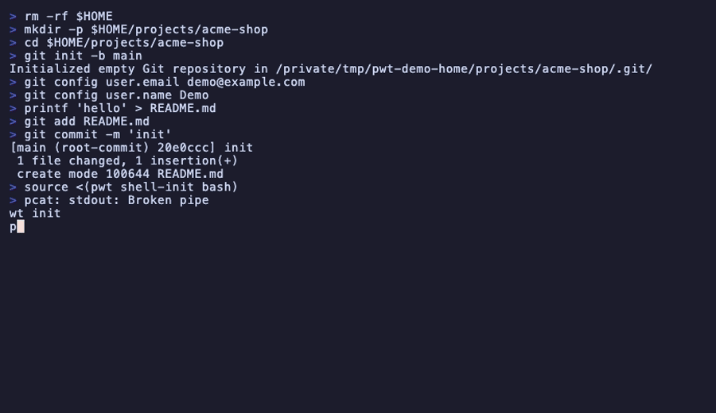
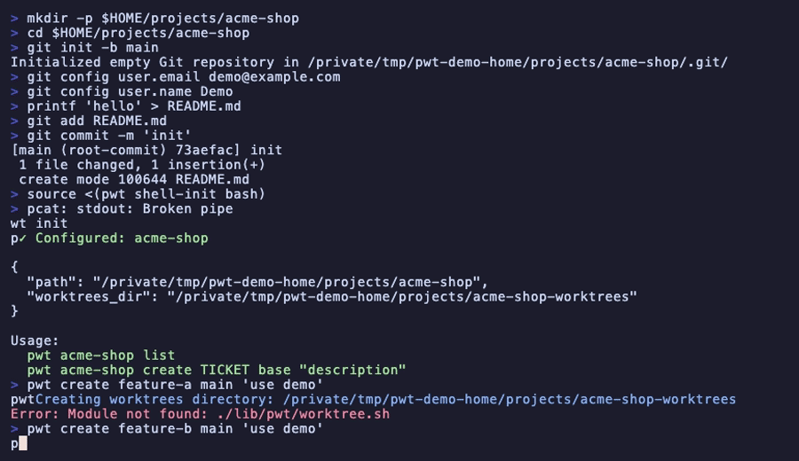

# pwt - Power Worktrees

**A powerful Git worktree workflow for today's multi-project development.**

[](https://github.com/jonasporto/pwt/actions/workflows/test.yml)
[](LICENSE)
[](CHANGELOG.md)

## Demos





[Watch overview (mp4)](examples/videos/00-overview.mp4)

More demos in `examples/` (tapes in `examples/tapes`, gifs in `examples/gifs`, how to record in `examples/README.md`).

---

✅ Work in parallel
— multiple projects, or parallel changes within the same project

✅ One stable workflow
— keep one editor open, swap branches underneath it

✅ No local conflicts
— automatic per-worktree ports, predictable dev servers

✅ Project-aware automation
— run setup, servers, and custom commands via Pwtfile

✅ Built on Git worktrees
— clones when isolation is required

---

## Install

### Homebrew

```bash
brew install jonasporto/pwt/pwt
```

### npm

```bash
npm i -g @jonasporto/pwt
```

### npx (without installing)

```bash
npx @jonasporto/pwt --help
```

### bun

```bash
bun add -g @jonasporto/pwt
```

### bunx (without installing)

```bash
bunx @jonasporto/pwt --help
```

### curl

```bash
curl -fsSL https://raw.githubusercontent.com/jonasporto/pwt/main/install.sh | bash
```

**Dependencies:** `git`, `jq` (required). `fzf`, `lsof` (optional but highly recommended).

See [INSTALL.md](INSTALL.md) for shell setup and troubleshooting.

---

## Quick Start

```bash
cd ~/projects/myapp
pwt init                        # Initialize project
pwt add feat/user-auth          # Create worktree from branch
pwt cd --select                 # Interactive worktree picker
pwt list                        # List worktrees with git status
```

### Custom commands (Pwtfile)

```bash
pwt editor                      # Open editor in current worktree
pwt build                       # Run build command
pwt server                      # Start dev server (auto port allocation)
pwt gateway up --port 5999      # Start stable project gateway daemon
pwt gateway use feat/user-auth  # Route gateway to a worktree server
pwt servers                     # Show active project servers
pwt ai                          # Start AI coding assistant
```

---

## Multi-Project

```bash
# See all configured projects
pwt project

# Jump to a worktree in another project
pwt backend cd security-patch

# Quick switch to another project's main
pwt backend

# Run commands in any project
pwt backend build
pwt backend server
```

---

## Pwtfile

Project-specific hooks.
Think *Makefile*, but for worktree lifecycle.

```bash
# Pwtfile
PORT_BASE=5001

setup() {
    pwtfile_copy ".env"
    pwtfile_symlink "node_modules"
    bundle install
}

server() {
    PORT="$PWT_PORT" npm start
}
```

**Variables:** `$PWT_PORT`, `$PWT_WORKTREE`, `$PWT_BRANCH`, `$PWT_PROJECT`, `$MAIN_APP`

Run `pwt help pwtfile` for full syntax.

---

## Shell Integration

```bash
# Add to ~/.zshrc or ~/.bashrc
eval "$(pwt shell-init zsh)"
```

Enables `pwt cd`, `pwt cd @`, `pwt cd -`, and tab completion.

---

## Everyday Commands

| Command | Description |
|---------|-------------|
| `init` | Initialize project in current repo |
| `add <branch>` | Create worktree from branch (`-e` editor, `-a` AI) |
| `track <remote-branch>` | Create worktree tracking an existing remote branch |
| `adopt [path]` | Register an existing worktree and run setup |
| `list` | List worktrees with git status (`--dirty`) |
| `cd <worktree>` | Navigate to worktree (`@` main, `-` previous, `--select`) |
| `project` | List all configured projects |
| `<project> cd <wt>` | Jump to worktree in another project |
| `editor` | Open editor in current worktree |
| `server` | Start dev server (from Pwtfile) |
| `gateway` | Stable project URL that routes to a worktree server |
| `servers` | Show active servers, gateway target, and background jobs |
| `ai` | Start AI coding assistant |
| `remove <worktree>` | Remove worktree (`--with-branch`) |

---

## Existing Remote Branches

Use `track` when you want to edit an existing remote branch directly without applying your configured `branch_prefix`:

```bash
pwt track origin/team/PROJ-1234
```

This creates a worktree named `PROJ-1234`, a local branch named `team/PROJ-1234`, configures tracking to `origin/team/PROJ-1234`, allocates metadata/port, and runs normal setup hooks.

Override the worktree name when the branch does not contain a clear ticket:

```bash
pwt track origin/team/fix-login-flow --name login-flow
```

Equivalent explicit `create` form:

```bash
pwt create PROJ-1234 --branch team/PROJ-1234 --from origin/team/PROJ-1234
```

If a worktree was already created with raw Git, adopt it into pwt:

```bash
pwt adopt /path/to/worktree
# or, from inside it
pwt setup
```

Adopted worktrees can live outside the configured `worktrees_dir`. pwt records
their real path in metadata, allocates a port, runs normal setup hooks, and then
includes them in `pwt list`, `pwt list --names`, `pwt cd`, `pwt use`,
`pwt current`, and `pwt info`.

---

## Stable Gateway

Each worktree keeps its own allocated port, but you can also run one stable
project-scoped gateway URL and switch which worktree it targets:

```bash
pwt gateway up --port 5999
pwt gateway use PROJ-1234
open "$(pwt gateway url)"
```

`pwt gateway up` runs a small local proxy daemon for the current project.
`pwt gateway use <worktree>` points new connections at that worktree's
allocated server port. If the target port is not listening and the project
Pwtfile defines `server()`, pwt starts it with `pwt server <worktree> --bg`
before switching the gateway.

Gateways are scoped by project:

```bash
pwt gateway down          # current project
pwt backend gateway down  # explicit project/alias from anywhere
```

Use `pwt servers` to see the gateway, current target, running server jobs, and
active ports. Add `--all` to include stopped worktrees.

---

## Worktree vs Clone

| Mode | When to use |
|------|-------------|
| **Worktree** (default) | Most cases — faster, shares git objects |
| **Clone** (`--clone`) | Submodules, or need same branch checked out twice |

---

## Plugins

Some features ship as plugins:

```bash
pwt aitools context     # Generate AI context
pwt extras benchmark    # Compare disk usage
```

Create your own: `pwt plugin create mycommand`

---

## Documentation

| Resource | Description |
|----------|-------------|
| `pwt help` | Quick command reference |
| `pwt help all` | Full docs (good for LLMs) |
| `man pwt` | Manual page |
| [INSTALL.md](INSTALL.md) | Installation guide |
| [FAQ.md](FAQ.md) | Frequently asked questions |
| [CHANGELOG.md](CHANGELOG.md) | Version history |

---

## Contributing

Contributions welcome! Please [open an issue](https://github.com/jonasporto/pwt/issues/new) first to discuss changes.

See [CONTRIBUTING.md](CONTRIBUTING.md) for development setup and guidelines.
